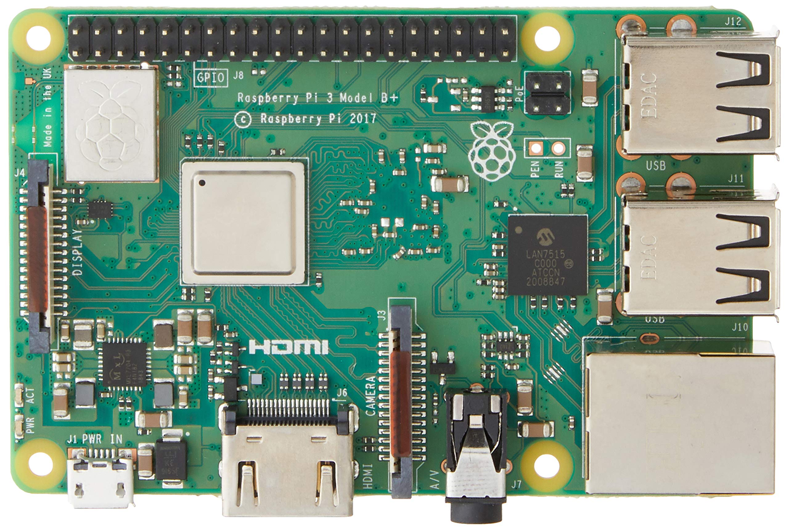

<p align="center">
  
</p>

<h1 align="center">Loopy</h1>
<h3 align="center">Distributed Health Monitoring System</h3>

<p align="center">
  A modular distributed health monitoring system based on a wearable Raspberry Pi armband,
  Android app, cloud backend and ML/AI analysis modules.
</p>

<!--=========================================================================-->

Loopy is a **distributed health monitoring system** based on a wearable armband device. It continuously collects, processes, and visualizes physiological and activity-related data through a modular and scalable architecture.

The system is composed of:
- a wearable embedded device (Raspberry Pi),
- an Android mobile application,
- multiple backend servers,
- data analysis and machine learning modules.

---

## Project Overview

Loopy is designed to provide **high-quality health monitoring** with improved comfort compared to traditional smartwatches.

**Main features:**
- Continuous acquisition of physiological data (heart rate, movement, temperature, blood oxygenation, etc.).
- Cloud-based data processing and storage.
- Advanced analytics using machine learning.
- AI-powered chatbot for personalized insights.
- Real-time visualization through a mobile application.

---

## System Architecture

The architecture is **modular and distributed**, composed of four main layers:

### 1. Embedded Layer (Raspberry Pi 3B+)
- Hosts the wearable device logic.
- Collects sensor data via Python scripts.
- Runs a JVM-based embedded application server.
- Sends data to backend servers.

### 2. Backend Layer
Two cloud-based application servers:
- **Application Server 1**: Handles user authentication, device management,data storage and communicates directly with the mobile app.
- **Application Server 2**: Dedicated to data processing, machine learning models, and the AI-powered chatbot.

### 3. Mobile Application Layer
- Android application written in Kotlin.
- Displays health data and manages the wearable device.
- Enables interaction with the AI assistant.

### 4. Data Flow Overview
1. Sensors collect physiological data.
2. Data is transmitted to backend servers.
3. Backend servers process and analyze the data.
4. Results are sent to the mobile application for visualization.

---

## Project Layout

The repository is organized as follows:

```
.
├── application-server-1
│   ├── bin
│   │   └── main
│   │       ├── database
│   │       │   ├── dao
│   │       │   │   ├── TabellaAccelerometroEntity.kt
│   │       │   │   ├── TabellaElettrodiEntity.kt
│   │       │   │   ├── TabellaPpgEntity.kt
│   │       │   │   ├── TabellaSensorsStatusEntity.kt
│   │       │   │   ├── TabellaTermometroEntity.kt
│   │       │   │   └── TabellaUserEntity.kt
│   │       │   ├── DatabaseConfig.kt
│   │       │   ├── QueryManager.kt
│   │       │   └── tables
│   │       │       ├── TabellaAccelerometroTable.kt
│   │       │       ├── TabellaElettrodiTable.kt
│   │       │       ├── TabellaPpgTable.kt
│   │       │       ├── TabellaSensorsStatusTable.kt
│   │       │       ├── TabellaTermometroTable.kt
│   │       │       └── TabellaUserTable.kt
│   │       ├── Main.kt
│   │       ├── models
│   │       │   ├── AccelerometerData.kt
│   │       │   ├── ElectrodeData.kt
│   │       │   ├── PPGData.kt
│   │       │   └── TermometerData.kt
│   │       ├── scripts
│   │       │   └── MainScript.kt
│   │       └── server
│   │           ├── jsonModels
│   │           │   ├── inputJsons
│   │           │   │   ├── AgentJson.kt
│   │           │   │   ├── RegisterJson.kt
│   │           │   │   ├── SaveDataJson.kt
│   │           │   │   └── UserJson.kt
│   │           │   └── outputJsons
│   │           │       ├── AccountJson.kt
│   │           │       ├── CsvDataJson.kt
│   │           │       ├── PredictJson.kt
│   │           │       ├── ReturnDataJson.kt
│   │           │       ├── StatusJson.kt
│   │           │       └── UserDataJson.kt
│   │           └── ServerConfig.kt
│   ├── build.gradle.kts
│   ├── Downloads
│   ├── gradle
│   │   └── wrapper
│   │       ├── gradle-wrapper.jar
│   │       └── gradle-wrapper.properties
│   ├── gradle.properties
│   ├── gradlew
│   ├── gradlew.bat
│   ├── settings.gradle.kts
│   └── src
│       └── main
│           └── kotlin
│               ├── database
│               │   ├── dao
│               │   │   ├── TabellaAccelerometroEntity.kt
│               │   │   ├── TabellaElettrodiEntity.kt
│               │   │   ├── TabellaPpgEntity.kt
│               │   │   ├── TabellaSensorsStatusEntity.kt
│               │   │   ├── TabellaTermometroEntity.kt
│               │   │   └── TabellaUserEntity.kt
│               │   ├── DatabaseConfig.kt
│               │   ├── QueryManager.kt
│               │   └── tables
│               │       ├── TabellaAccelerometroTable.kt
│               │       ├── TabellaElettrodiTable.kt
│               │       ├── TabellaPpgTable.kt
│               │       ├── TabellaSensorsStatusTable.kt
│               │       ├── TabellaTermometroTable.kt
│               │       └── TabellaUserTable.kt
│               ├── Main.kt
│               ├── models
│               │   ├── AccelerometerData.kt
│               │   ├── ElectrodeData.kt
│               │   ├── PPGData.kt
│               │   └── TermometerData.kt
│               ├── scripts
│               │   └── MainScript.kt
│               └── server
│                   ├── jsonModels
│                   │   ├── inputJsons
│                   │   │   ├── AgentJson.kt
│                   │   │   ├── RegisterJson.kt
│                   │   │   ├── SaveDataJson.kt
│                   │   │   └── UserJson.kt
│                   │   └── outputJsons
│                   │       ├── AccountJson.kt
│                   │       ├── CsvDataJson.kt
│                   │       ├── PredictJson.kt
│                   │       ├── ReturnDataJson.kt
│                   │       ├── StatusJson.kt
│                   │       └── UserDataJson.kt
│                   └── ServerConfig.kt
├── application-server-2
│   ├── bin
│   ├── gradle.properties
│   ├── gradlew
│   ├── gradlew.bat
│   ├── lets-plot-images
│   ├── settings.gradle.kts
│   └── src
│       ├── main
│       │   ├── kotlin
│       │   │   ├── aiAgent
│       │   │   │   ├── AgentCreation.kt
│       │   │   │   ├── customModels
│       │   │   │   │   └── OpenRouterCustomModels.kt
│       │   │   │   └── strategies
│       │   │   │       └── SimpleStrategy.kt
│       │   │   ├── database
│       │   │   │   ├── dao
│       │   │   │   │   ├── TabellaActivityEntity.kt
│       │   │   │   │   ├── TabellaGlucosioEntity.kt
│       │   │   │   │   ├── TabellaSleepEntity.kt
│       │   │   │   │   └── TabellaStressEntity.kt
│       │   │   │   ├── DatabaseConfig.kt
│       │   │   │   ├── QueryManager.kt
│       │   │   │   └── table
│       │   │   │       ├── TabellaActivityTable.kt
│       │   │   │       ├── TabellaGlucosioTable.kt
│       │   │   │       ├── TabellaSleepTable.kt
│       │   │   │       └── TabellaStressTable.kt
│       │   │   ├── graph
│       │   │   │   └── GraphsManagement.kt
│       │   │   ├── Main.kt
│       │   │   ├── script
│       │   │   │   └── MainScript.kt
│       │   │   ├── server
│       │   │   │   ├── inputJsons
│       │   │   │   │   ├── AgentJson.kt
│       │   │   │   │   ├── CsvDataJson.kt
│       │   │   │   │   ├── RegisterJson.kt
│       │   │   │   │   ├── ReturnDataJson.kt
│       │   │   │   │   ├── SaveDataJson.kt
│       │   │   │   │   ├── UserDataJson.kt
│       │   │   │   │   └── UserJson.kt
│       │   │   │   ├── outputJsons
│       │   │   │   │   ├── AccountJson.kt
│       │   │   │   │   ├── PredictJson.kt
│       │   │   │   │   ├── ReturnSSAGDataJson.kt
│       │   │   │   │   └── StatusJson.kt
│       │   │   │   └── ServerConfig.kt
│       │   │   └── utils
│       │   │       └── URL.kt
│       │   └── resources
│       └── test
│           ├── kotlin
│           └── resources
├── documentation
│   ├── Functional_Sheet_Loopy.pdf
│   ├── Presentazione Loopy.pptx
│   └── Technical_Sheet_Loopy.pdf
├── glucose-calculator-ML
│   ├── csvs
│   │   └── result.csv
│   ├── models
│   │   └── model_rf.pkl
│   ├── predict.py
│   └── train.py
├── images
│   ├── loopy_logo.png
│   └── Raspberry_pi_3B+.jpg
├── metric-calculator
│   ├── calc_metriche_diurne.py
│   ├── calc_metriche_notturne.py
│   ├── db_utils.py
│   └── TODO.txt
├── mobile-app
│   ├── app
│   │   ├── build.gradle.kts
│   │   ├── proguard-rules.pro
│   │   └── src
│   │       ├── androidTest
│   │       │   └── java
│   │       │       └── com
│   │       │           └── example
│   │       │               └── loopy
│   │       │                   └── ExampleInstrumentedTest.kt
│   │       ├── main
│   │       │   ├── AndroidManifest.xml
│   │       │   ├── ic_launcher-playstore.png
│   │       │   ├── java
│   │       │   │   └── com
│   │       │   │       └── example
│   │       │   │           └── loopy
│   │       │   │               ├── chat
│   │       │   │               │   ├── ChatActivity.kt
│   │       │   │               │   └── scripts
│   │       │   │               │       ├── AgentJson.kt
│   │       │   │               │       └── ChatCaller.kt
│   │       │   │               ├── data
│   │       │   │               │   ├── DataActivity.kt
│   │       │   │               │   └── models
│   │       │   │               │       ├── DataDisplay.kt
│   │       │   │               │       ├── DataViewModel.kt
│   │       │   │               │       └── input
│   │       │   │               │           ├── ReturnDataJson.kt
│   │       │   │               │           └── ReturnSSAGDataJson.kt
│   │       │   │               ├── devicemanager
│   │       │   │               │   ├── DeviceManagerActivity.kt
│   │       │   │               │   └── models
│   │       │   │               │       └── StatusJson.kt
│   │       │   │               ├── login
│   │       │   │               │   ├── LoginActivity.kt
│   │       │   │               │   ├── models
│   │       │   │               │   │   ├── input
│   │       │   │               │   │   │   ├── RegisterJson.kt
│   │       │   │               │   │   │   └── UserJson.kt
│   │       │   │               │   │   └── output
│   │       │   │               │   │       └── AccountJson.kt
│   │       │   │               │   ├── RegisterActivity.kt
│   │       │   │               │   └── RegisterListSet.kt
│   │       │   │               ├── MainActivity.kt
│   │       │   │               ├── network
│   │       │   │               │   └── KtorClient.kt
│   │       │   │               ├── profile
│   │       │   │               │   ├── json
│   │       │   │               │   │   └── UserDataJson.kt
│   │       │   │               │   └── ProfileActivity.kt
│   │       │   │               ├── settings
│   │       │   │               │   ├── EditAccountActivity.kt
│   │       │   │               │   ├── EditAccountListSet.kt
│   │       │   │               │   └── SettingsActivity.kt
│   │       │   │               ├── ui
│   │       │   │               │   └── theme
│   │       │   │               │       ├── Color.kt
│   │       │   │               │       ├── Theme.kt
│   │       │   │               │       └── Type.kt
│   │       │   │               └── utils
│   │       │   │                   ├── BaseActivity.kt
│   │       │   │                   ├── GraphAdapter.kt
│   │       │   │                   ├── SessionManager.kt
│   │       │   │                   └── URL.kt
│   │       │   └── res
│   │       │       ├── color
│   │       │       │   └── bottom_nav_selector.xml
│   │       │       ├── drawable
│   │       │       │   ├── agent_message_text_background.xml
│   │       │       │   ├── bg_chat.png
│   │       │       │   ├── bg_empty.png
│   │       │       │   ├── bg_home.png
│   │       │       │   ├── bg_login.png
│   │       │       │   ├── bg_profile.png
│   │       │       │   ├── bg_register.png
│   │       │       │   ├── bottom_nav_bg.xml
│   │       │       │   ├── circular_container.xml
│   │       │       │   ├── edit_text_background.xml
│   │       │       │   ├── ic_chatbot.xml
│   │       │       │   ├── ic_data.xml
│   │       │       │   ├── ic_dm.xml
│   │       │       │   ├── ic_home.xml
│   │       │       │   ├── ic_launcher_background.xml
│   │       │       │   ├── ic_launcher_foreground.xml
│   │       │       │   ├── ic_profile.xml
│   │       │       │   ├── ic_settings.xml
│   │       │       │   ├── login_button_background.xml
│   │       │       │   ├── loopy_bot_avatar.png
│   │       │       │   ├── loopy_hompage_recap.xml
│   │       │       │   ├── loopy_logo.png
│   │       │       │   ├── rounded_button.xml
│   │       │       │   └── user_message_text_background.xml
│   │       │       ├── font
│   │       │       │   ├── adlam_display.xml
│   │       │       │   ├── alex_brush.ttf
│   │       │       │   ├── alfa_slab_one.xml
│   │       │       │   └── dancingscript_variablefont_wght.ttf
│   │       │       ├── layout
│   │       │       │   ├── chat_activity.xml
│   │       │       │   ├── data_activity.xml
│   │       │       │   ├── dm_activity.xml
│   │       │       │   ├── edit_account_activity.xml
│   │       │       │   ├── edit_profile_activity.xml
│   │       │       │   ├── item_graph.xml
│   │       │       │   ├── login_activity.xml
│   │       │       │   ├── main_activity.xml
│   │       │       │   ├── profile_activity.xml
│   │       │       │   ├── register_activity.xml
│   │       │       │   ├── settings_activity.xml
│   │       │       │   └── view_bottom_nav.xml
│   │       │       ├── menu
│   │       │       │   └── bottom_nav_menu.xml
│   │       │       ├── mipmap-anydpi-v26
│   │       │       │   ├── ic_launcher_round.xml
│   │       │       │   └── ic_launcher.xml
│   │       │       ├── mipmap-hdpi
│   │       │       │   ├── ic_launcher_round.webp
│   │       │       │   └── ic_launcher.webp
│   │       │       ├── mipmap-mdpi
│   │       │       │   ├── ic_launcher_round.webp
│   │       │       │   └── ic_launcher.webp
│   │       │       ├── mipmap-xhdpi
│   │       │       │   ├── ic_launcher_round.webp
│   │       │       │   └── ic_launcher.webp
│   │       │       ├── mipmap-xxhdpi
│   │       │       │   ├── ic_launcher_round.webp
│   │       │       │   └── ic_launcher.webp
│   │       │       ├── mipmap-xxxhdpi
│   │       │       │   ├── ic_launcher_round.webp
│   │       │       │   └── ic_launcher.webp
│   │       │       ├── values
│   │       │       │   ├── colors.xml
│   │       │       │   ├── font_certs.xml
│   │       │       │   ├── preloaded_fonts.xml
│   │       │       │   ├── strings.xml
│   │       │       │   └── themes.xml
│   │       │       └── xml
│   │       │           ├── backup_rules.xml
│   │       │           └── data_extraction_rules.xml
│   │       └── test
│   │           └── java
│   │               └── com
│   │                   └── example
│   │                       └── loopy
│   │                           └── ExampleUnitTest.kt
│   ├── build.gradle.kts
│   ├── gradle
│   │   ├── libs.versions.toml
│   │   └── wrapper
│   │       ├── gradle-wrapper.jar
│   │       └── gradle-wrapper.properties
│   ├── gradle.properties
│   ├── gradlew
│   ├── gradlew.bat
│   ├── local.properties
│   └── settings.gradle.kts
├── raspberry-pi-server-logic
│   ├── main-server
│   │   ├── bin
│   │   │   └── main
│   │   │       ├── database
│   │   │       │   ├── dao
│   │   │       │   │   ├── TabellaAccelerometroEntity.kt
│   │   │       │   │   ├── TabellaElettrodiEntity.kt
│   │   │       │   │   ├── TabellaPpgEntity.kt
│   │   │       │   │   └── TabellaTermometroEntity.kt
│   │   │       │   ├── DatabaseConfig.kt
│   │   │       │   ├── QueryManagement.kt
│   │   │       │   └── tables
│   │   │       │       ├── TabellaAccelerometroTable.kt
│   │   │       │       ├── TabellaElettrodiTable.kt
│   │   │       │       ├── TabellaPpgTable.kt
│   │   │       │       └── TabellaTermometroTable.kt
│   │   │       ├── Main.kt
│   │   │       ├── models
│   │   │       │   ├── AccelerometerData.kt
│   │   │       │   ├── ElectrodeData.kt
│   │   │       │   ├── PPGData.kt
│   │   │       │   └── TermometerData.kt
│   │   │       ├── scripts
│   │   │       │   └── MainScript.kt
│   │   │       └── server
│   │   │           ├── inputJsons
│   │   │           │   └── SaveDataJson.kt
│   │   │           ├── outputJsons
│   │   │           │   ├── ReturnDataJson.kt
│   │   │           │   └── StatusJson.kt
│   │   │           └── ServerConfig.kt
│   │   ├── build
│   │   │   ├── classes
│   │   │   │   └── kotlin
│   │   │   │       ├── main
│   │   │   │       │   ├── database
│   │   │   │       │   │   ├── dao
│   │   │   │       │   │   │   ├── TabellaAccelerometroEntity.class
│   │   │   │       │   │   │   ├── TabellaAccelerometroEntity$Companion.class
│   │   │   │       │   │   │   ├── TabellaElettrodiEntity.class
│   │   │   │       │   │   │   ├── TabellaElettrodiEntity$Companion.class
│   │   │   │       │   │   │   ├── TabellaPpgEntity.class
│   │   │   │       │   │   │   ├── TabellaPpgEntity$Companion.class
│   │   │   │       │   │   │   ├── TabellaTermometroEntity.class
│   │   │   │       │   │   │   └── TabellaTermometroEntity$Companion.class
│   │   │   │       │   │   ├── DatabaseConfig.class
│   │   │   │       │   │   ├── QueryManagement.class
│   │   │   │       │   │   └── tables
│   │   │   │       │   │       ├── TabellaAccelerometroTable.class
│   │   │   │       │   │       ├── TabellaElettrodiTable.class
│   │   │   │       │   │       ├── TabellaPpgTable.class
│   │   │   │       │   │       └── TabellaTermometroTable.class
│   │   │   │       │   ├── Main.class
│   │   │   │       │   ├── META-INF
│   │   │   │       │   │   └── main-server.kotlin_module
│   │   │   │       │   ├── models
│   │   │   │       │   │   ├── AccelerometerData.class
│   │   │   │       │   │   ├── ElectrodeData.class
│   │   │   │       │   │   ├── PPGData.class
│   │   │   │       │   │   └── TermometerData.class
│   │   │   │       │   ├── scripts
│   │   │   │       │   │   └── MainScript.class
│   │   │   │       │   └── server
│   │   │   │       │       ├── inputJsons
│   │   │   │       │       │   ├── SaveDataJson.class
│   │   │   │       │       │   ├── SaveDataJson$$serializer.class
│   │   │   │       │       │   └── SaveDataJson$Companion.class
│   │   │   │       │       ├── outputJsons
│   │   │   │       │       │   ├── ReturnDataJson.class
│   │   │   │       │       │   ├── ReturnDataJson$$serializer.class
│   │   │   │       │       │   ├── ReturnDataJson$Companion.class
│   │   │   │       │       │   ├── StatusJson.class
│   │   │   │       │       │   ├── StatusJson$$serializer.class
│   │   │   │       │       │   └── StatusJson$Companion.class
│   │   │   │       │       ├── ServerConfig.class
│   │   │   │       │       ├── ServerConfig$run$1.class
│   │   │   │       │       ├── ServerConfigKt.class
│   │   │   │       │       ├── ServerConfigKt$module$3$1.class
│   │   │   │       │       ├── ServerConfigKt$module$3$2.class
│   │   │   │       │       ├── ServerConfigKt$module$3$3.class
│   │   │   │       │       ├── ServerConfigKt$module$3$4.class
│   │   │   │       │       ├── ServerConfigKt$module$3$5.class
│   │   │   │       │       ├── ServerConfigKt$module$3$6.class
│   │   │   │       │       ├── ServerConfigKt$module$3$7.class
│   │   │   │       │       └── ServerConfigKt$module$3$8.class
│   │   │   │       └── test
│   │   │   ├── kotlin
│   │   │   │   └── compileKotlin
│   │   │   │       ├── cacheable
│   │   │   │       │   ├── caches-jvm
│   │   │   │       │   │   ├── inputs
│   │   │   │       │   │   │   ├── source-to-output.tab
│   │   │   │       │   │   │   ├── source-to-output.tab_i
│   │   │   │       │   │   │   ├── source-to-output.tab_i.len
│   │   │   │       │   │   │   ├── source-to-output.tab.keystream
│   │   │   │       │   │   │   ├── source-to-output.tab.keystream.len
│   │   │   │       │   │   │   ├── source-to-output.tab.len
│   │   │   │       │   │   │   └── source-to-output.tab.values.at
│   │   │   │       │   │   ├── jvm
│   │   │   │       │   │   │   └── kotlin
│   │   │   │       │   │   │       ├── class-attributes.tab
│   │   │   │       │   │   │       ├── class-attributes.tab_i
│   │   │   │       │   │   │       ├── class-attributes.tab_i.len
│   │   │   │       │   │   │       ├── class-attributes.tab.keystream
│   │   │   │       │   │   │       ├── class-attributes.tab.keystream.len
│   │   │   │       │   │   │       ├── class-attributes.tab.len
│   │   │   │       │   │   │       ├── class-attributes.tab.values.at
│   │   │   │       │   │   │       ├── class-fq-name-to-source.tab
│   │   │   │       │   │   │       ├── class-fq-name-to-source.tab_i
│   │   │   │       │   │   │       ├── class-fq-name-to-source.tab_i.len
│   │   │   │       │   │   │       ├── class-fq-name-to-source.tab.keystream
│   │   │   │       │   │   │       ├── class-fq-name-to-source.tab.keystream.len
│   │   │   │       │   │   │       ├── class-fq-name-to-source.tab.len
│   │   │   │       │   │   │       ├── class-fq-name-to-source.tab.values.at
│   │   │   │       │   │   │       ├── internal-name-to-source.tab
│   │   │   │       │   │   │       ├── internal-name-to-source.tab_i
│   │   │   │       │   │   │       ├── internal-name-to-source.tab_i.len
│   │   │   │       │   │   │       ├── internal-name-to-source.tab.keystream
│   │   │   │       │   │   │       ├── internal-name-to-source.tab.keystream.len
│   │   │   │       │   │   │       ├── internal-name-to-source.tab.len
│   │   │   │       │   │   │       ├── internal-name-to-source.tab.values.at
│   │   │   │       │   │   │       ├── package-parts.tab
│   │   │   │       │   │   │       ├── package-parts.tab_i
│   │   │   │       │   │   │       ├── package-parts.tab_i.len
│   │   │   │       │   │   │       ├── package-parts.tab.keystream
│   │   │   │       │   │   │       ├── package-parts.tab.keystream.len
│   │   │   │       │   │   │       ├── package-parts.tab.len
│   │   │   │       │   │   │       ├── package-parts.tab.values.at
│   │   │   │       │   │   │       ├── proto.tab
│   │   │   │       │   │   │       ├── proto.tab_i
│   │   │   │       │   │   │       ├── proto.tab_i.len
│   │   │   │       │   │   │       ├── proto.tab.keystream
│   │   │   │       │   │   │       ├── proto.tab.keystream.len
│   │   │   │       │   │   │       ├── proto.tab.len
│   │   │   │       │   │   │       ├── proto.tab.values.at
│   │   │   │       │   │   │       ├── source-to-classes.tab
│   │   │   │       │   │   │       ├── source-to-classes.tab_i
│   │   │   │       │   │   │       ├── source-to-classes.tab_i.len
│   │   │   │       │   │   │       ├── source-to-classes.tab.keystream
│   │   │   │       │   │   │       ├── source-to-classes.tab.keystream.len
│   │   │   │       │   │   │       ├── source-to-classes.tab.len
│   │   │   │       │   │   │       ├── source-to-classes.tab.values.at
│   │   │   │       │   │   │       ├── subtypes.tab
│   │   │   │       │   │   │       ├── subtypes.tab_i
│   │   │   │       │   │   │       ├── subtypes.tab_i.len
│   │   │   │       │   │   │       ├── subtypes.tab.keystream
│   │   │   │       │   │   │       ├── subtypes.tab.keystream.len
│   │   │   │       │   │   │       ├── subtypes.tab.len
│   │   │   │       │   │   │       ├── subtypes.tab.values.at
│   │   │   │       │   │   │       ├── supertypes.tab
│   │   │   │       │   │   │       ├── supertypes.tab_i
│   │   │   │       │   │   │       ├── supertypes.tab_i.len
│   │   │   │       │   │   │       ├── supertypes.tab.keystream
│   │   │   │       │   │   │       ├── supertypes.tab.keystream.len
│   │   │   │       │   │   │       ├── supertypes.tab.len
│   │   │   │       │   │   │       └── supertypes.tab.values.at
│   │   │   │       │   │   └── lookups
│   │   │   │       │   │       ├── counters.tab
│   │   │   │       │   │       ├── file-to-id.tab
│   │   │   │       │   │       ├── file-to-id.tab_i
│   │   │   │       │   │       ├── file-to-id.tab_i.len
│   │   │   │       │   │       ├── file-to-id.tab.keystream
│   │   │   │       │   │       ├── file-to-id.tab.keystream.len
│   │   │   │       │   │       ├── file-to-id.tab.len
│   │   │   │       │   │       ├── file-to-id.tab.values.at
│   │   │   │       │   │       ├── id-to-file.tab
│   │   │   │       │   │       ├── id-to-file.tab_i
│   │   │   │       │   │       ├── id-to-file.tab_i.len
│   │   │   │       │   │       ├── id-to-file.tab.keystream
│   │   │   │       │   │       ├── id-to-file.tab.keystream.len
│   │   │   │       │   │       ├── id-to-file.tab.len
│   │   │   │       │   │       ├── id-to-file.tab.values.at
│   │   │   │       │   │       ├── lookups.tab
│   │   │   │       │   │       ├── lookups.tab_i
│   │   │   │       │   │       ├── lookups.tab_i.len
│   │   │   │       │   │       ├── lookups.tab.keystream
│   │   │   │       │   │       ├── lookups.tab.keystream.len
│   │   │   │       │   │       ├── lookups.tab.len
│   │   │   │       │   │       └── lookups.tab.values.at
│   │   │   │       │   └── last-build.bin
│   │   │   │       ├── classpath-snapshot
│   │   │   │       │   └── shrunk-classpath-snapshot.bin
│   │   │   │       └── local-state
│   │   │   ├── libs
│   │   │   │   └── server.jar
│   │   │   ├── reports
│   │   │   │   └── problems
│   │   │   │       └── problems-report.html
│   │   │   └── tmp
│   │   │       └── shadowJar
│   │   │           └── MANIFEST.MF
│   │   ├── build.gradle.kts
│   │   ├── gradle
│   │   │   └── wrapper
│   │   │       ├── gradle-wrapper.jar
│   │   │       └── gradle-wrapper.properties
│   │   ├── gradle.properties
│   │   ├── gradlew
│   │   ├── gradlew.bat
│   │   ├── settings.gradle.kts
│   │   └── src
│   │       └── main
│   │           └── kotlin
│   │               ├── database
│   │               │   ├── dao
│   │               │   │   ├── TabellaAccelerometroEntity.kt
│   │               │   │   ├── TabellaElettrodiEntity.kt
│   │               │   │   ├── TabellaPpgEntity.kt
│   │               │   │   └── TabellaTermometroEntity.kt
│   │               │   ├── DatabaseConfig.kt
│   │               │   ├── QueryManagement.kt
│   │               │   └── tables
│   │               │       ├── TabellaAccelerometroTable.kt
│   │               │       ├── TabellaElettrodiTable.kt
│   │               │       ├── TabellaPpgTable.kt
│   │               │       └── TabellaTermometroTable.kt
│   │               ├── Main.kt
│   │               ├── models
│   │               │   ├── AccelerometerData.kt
│   │               │   ├── ElectrodeData.kt
│   │               │   ├── PPGData.kt
│   │               │   └── TermometerData.kt
│   │               ├── scripts
│   │               │   └── MainScript.kt
│   │               └── server
│   │                   ├── inputJsons
│   │                   │   └── SaveDataJson.kt
│   │                   ├── outputJsons
│   │                   │   ├── ReturnDataJson.kt
│   │                   │   └── StatusJson.kt
│   │                   └── ServerConfig.kt
│   └── raspberry-sensors-logic
│       ├── config.py
│       ├── gyroscope.c
│       ├── Makefile
│       ├── orchestrator.py
│       ├── ppg_sensor.c
│       ├── requirements.txt
│       └── temp_sensor.c
├── README.md
└── tree.txt

943 directories, 2110 files

```

### Source Code Organization

* **`mobile-app/`**
  Android application developed in Kotlin for data visualization and user interaction.

* **`application-server-1/`**
  Backend server responsible for authentication, device management, and data storage.

* **`application-server-2/`**
  Backend server dedicated to data analysis, machine learning, and the AI chatbot.

* **`raspberry-pi-3B+-server-logic/`**
  Software running on the wearable device:
  * `main-server/`: JVM-based embedded server.
  * `raspberry-sensors-logic/`: Python scripts for direct sensor interaction.

* **`metric-calculator/`**
  Python module for computing daily and nightly health metrics.

* **`glucose-calculator-ML/`**
  Machine learning module for glucose level prediction.

* **`documentation/`**
  Project documentation, slides, and additional resources.

---

## Hardware and Software Requirements

### Hardware Requirements
- Raspberry Pi 3B+ (wearable device)
- Health monitoring sensors
- Android smartphone
- Cloud infrastructure (e.g., AWS EC2 or equivalent)

<p align="center">
  
</p>

### Software Requirements
- Android Studio (latest stable version)
- Java Development Kit (JDK)
- Python 3
- Gradle (via Gradle Wrapper)
- Git 

---

## How to Build and Run the Project

### Mobile Application
1. Open the `mobile-app/` directory with Android Studio.
2. Sync the project with Gradle files.
3. Build and run the application on an Android device or emulator.

### Backend Application Servers
1. Navigate to `application-server-1/` or `application-server-2/`.
2. Build the project using the Gradle Wrapper:

        ./gradlew build

3. Run the server as a standalone JVM application. Can be deployed on cloud infrastructure or run locally.

### Embedded Raspberry Pi Components
- **JVM Server**: Build using Gradle and run on the Raspberry Pi 3B+.
- **Python Scripts**: Execute directly on the Raspberry Pi to interface with sensors.

### Data Processing and ML Modules
- Python-based modules found in `metric-calculator/` and `glucose-calculator-ML/`.
- Can be executed independently for data analysis, model training, and predictions.

---

## User Guide

### Account Management
- **Registration**: Create an account via the mobile application.
- **Profile**: Manage personal information in the settings page.
- **Deletion**: Accounts can be deleted at any time from settings.

### Application Usage
- **Home Page**: Overview of current health status and recent metrics.
- **Data Page**: Detailed numerical health data and history.
- **Chat Page**: Interact with the AI-powered assistant for health advice.
- **Device Manager**: Check the status of the wearable device and sensors.

---

## Team Members and Contributions

* **Nicola Avellino**: Embedded development, data management logic, Raspberry Pi 3B+ sensor implementation, Android mobile application development.
* **Simone Battisti**: Backend services, data processing modules, AI/ML integration, system architecture, Android mobile application development, documentation.
* **Liam Demattè**: Embedded system logic, sensor integration, hardware architecture, Android mobile application development.
* **Riccardo Gonzato**: Android mobile application development, system integration, documentation.

All team members collaborated on system design, testing, and overall project integration.

---

## External Resources

* **Project Repository**: (https://github.com/Sim0Batt/Loopy).
* **Presentation Slides**: Available in the `documentation/` folder.
* **Demo Video**: [YouTube Link](https://youtu.be/jCYuJQEsTf8).
